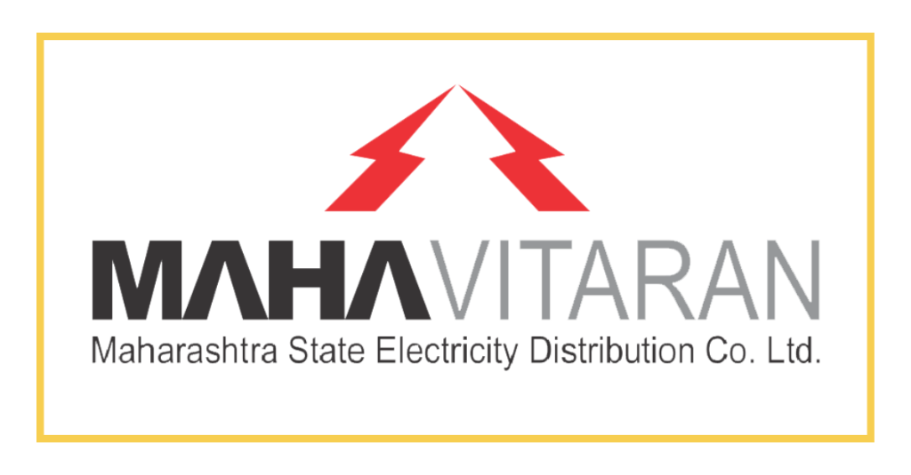

<p align="center">
  
</p>

<h1 align="center">⚡ VidyuSaathi — Vidyut SurakshaSaathi</h1>

<p align="center">
  <b>A Government-Grade, AI-Powered Complaint Management System for Mahavitran (MSEDCL)</b>
</p>

<p align="center">
  
  
  
  
</p>

---

## 📋 Table of Contents

- [About the Project](#about-the-project)
- [Problem Statement](#problem-statement)
- [Solution & Key Innovations](#solution--key-innovations)
- [Tech Stack](#tech-stack)
- [Architecture Overview](#architecture-overview)
- [Features — Citizen Module](#features--citizen-module)
- [Features — Officer Module](#features--officer-module)
- [Features — Admin Portal](#features--admin-portal)
- [Hierarchical Officer Structure](#hierarchical-officer-structure)
- [Automatic Escalation Engine](#automatic-escalation-engine)
- [Intelligent Complaint Clustering](#intelligent-complaint-clustering)
- [Notification System](#notification-system)
- [Geospatial Auto-Assignment](#geospatial-auto-assignment)
- [Complaint Type Database & Auto-Suggest](#complaint-type-database--auto-suggest)
- [Data Seeding System](#data-seeding-system)
- [Project Directory Structure](#project-directory-structure)
- [Firebase Collections Schema](#firebase-collections-schema)
- [Setup Instructions](#setup-instructions)
- [Prototype](#prototype)

---

## About the Project

**VidyuSaathi** (Vidyut SurakshaSaathi) is a comprehensive, production-ready mobile application developed for **Mahavitran (Maharashtra State Electricity Distribution Co. Ltd.)**. It serves as a unified platform connecting **citizens**, **field officers**, and **administrators** to manage, track, escalate, and resolve electricity-related complaints and service issues across the state of Maharashtra.

The application mirrors the real-world organizational hierarchy of Mahavitran — from **Field Engineers (FE)** at the grassroots level all the way up to the **Chief Engineer (CE)** at the district level — ensuring that every complaint is automatically routed, tracked, and if necessary, escalated through the proper chain of command.

---

## Problem Statement

Electricity-related complaints in Maharashtra often face:

1. **Delayed Response** — No centralized system to track and route complaints to the appropriate officer.
2. **Manual Escalation** — Unresolved complaints require manual follow-ups, causing critical safety issues (e.g., live wires, transformer fires) to remain unaddressed for hours.
3. **Lack of Transparency** — Citizens have no visibility into the status or progress of their complaints.
4. **No Accountability** — Without automatic escalation and SLA tracking, there is no mechanism to ensure officers resolve issues within mandated timeframes.
5. **Area-Wide Problem Identification** — Isolated complaints that are actually part of a larger area-wide outage are not identified or grouped together.

---

## Solution & Key Innovations

VidyuSaathi solves these problems with the following core innovations:

| Innovation | Description |
|---|---|
| **🗺️ Geospatial Auto-Assignment** | Complaints are automatically assigned to the nearest Mahavitran office and its Junior Engineer based on GPS coordinates. |
| **⏰ SLA Engine with Auto-Escalation** | Each complaint type has a defined SLA (e.g., Critical: 2 min, High: 6 hours). If the SLA is breached, the complaint is automatically escalated to the next officer in the hierarchy. |
| **🔗 Intelligent Complaint Clustering** | Complaints with similar titles within a 200-meter radius and 24-hour time window are automatically grouped into clusters. Resolving one resolves all. |
| **📊 Role-Based Dashboards** | Each officer role (FE → JE → AE → DyEE → EE → SE → CE) has a dedicated dashboard with metrics relevant to their jurisdiction. |
| **🔔 Real-Time Notifications** | Citizens and officers receive instant in-app notifications for every status change, assignment, and escalation event. |
| **🤖 Smart Auto-Suggest** | Complaint titles are auto-suggested from a curated database of 60+ real-world electricity complaints, each with pre-configured priority and SLA. |

---

## Tech Stack

| Layer | Technology |
|---|---|
| **Frontend** | Flutter (Dart) — Material 3 Design |
| **Backend** | Firebase (Google Cloud) |
| **Authentication** | Firebase Authentication (Email/Password) |
| **Database** | Cloud Firestore (NoSQL, Real-time) |
| **File Storage** | Firebase Storage (Complaint images) |
| **Push Notifications** | Firebase Cloud Messaging (FCM) + Local Notifications |
| **Serverless Functions** | Firebase Cloud Functions (Node.js) |
| **State Management** | Provider |
| **Maps** | flutter_map + OpenStreetMap (OSM) |
| **Charts** | fl_chart (Pie charts for analytics) |
| **Geolocation** | Geolocator package |
| **Image Capture** | image_picker (Camera only — to prevent fake complaints) |

### Key Packages

```yaml
dependencies:
  firebase_core, firebase_auth, cloud_firestore, firebase_storage
  firebase_messaging, cloud_functions
  provider                          # State management
  google_fonts                      # Custom typography
  geolocator                        # GPS location capture
  image_picker                      # Camera-only image capture
  fl_chart                          # Dashboard analytics charts
  flutter_map, latlong2             # OpenStreetMap integration
  url_launcher                      # Open Google Maps navigation
  audioplayers                      # Notification sounds
  flutter_local_notifications       # Local push notifications
  uuid                              # Unique ticket/cluster IDs
  intl                              # Date/time formatting
```

---

## Architecture Overview

```
┌─────────────────────────────────────────────────────────────────────┐
│                        FLUTTER APPLICATION                          │
│                                                                     │
│  ┌──────────┐   ┌──────────┐   ┌──────────┐   ┌──────────────────┐ │
│  │ Citizen   │   │ Officer  │   │  Admin   │   │  Auth (Login/    │ │
│  │ Module    │   │ Module   │   │  Portal  │   │  Register)       │ │
│  └─────┬────┘   └─────┬────┘   └─────┬────┘   └──────────────────┘ │
│        │              │              │                              │
│  ┌─────┴──────────────┴──────────────┴──────┐                       │
│  │              SERVICE LAYER               │                       │
│  │  ┌───────────┐  ┌──────────────────────┐ │                       │
│  │  │ Database  │  │ Escalation Service   │ │                       │
│  │  │ Service   │  │ (Timer-based SLA)    │ │                       │
│  │  ├───────────┤  ├──────────────────────┤ │                       │
│  │  │ Auth      │  │ Clustering Service   │ │                       │
│  │  │ Service   │  │ (Geo + Title match)  │ │                       │
│  │  ├───────────┤  ├──────────────────────┤ │                       │
│  │  │ Notif.    │  │ Seeder Service       │ │                       │
│  │  │ Service   │  │ (Hierarchy + Data)   │ │                       │
│  │  └───────────┘  └──────────────────────┘ │                       │
│  └──────────────────────────────────────────┘                       │
│                          │                                          │
│  ┌───────────────────────┴──────────────────────────────────┐       │
│  │                    FIREBASE BACKEND                       │       │
│  │  Firestore | Auth | Storage | Cloud Functions | FCM       │       │
│  └───────────────────────────────────────────────────────────┘       │
└─────────────────────────────────────────────────────────────────────┘
```

---

## Features — Citizen Module

### 🔐 Authentication
- **Secure Registration** — Citizens register with name, email, phone, address, and consumer number.
- **Secure Login** — Email/password-based authentication via Firebase Auth.

### 📝 Report an Issue
- **Auto-Suggest Complaint Titles** — As the citizen types, the system auto-suggests from 60+ pre-configured electricity complaint types (e.g., "Transformer blast", "Live wire in water puddle", "Street light not working").
- **Auto-Priority Assignment** — Selecting a pre-configured complaint type automatically sets the priority level (Critical / High / Medium / Low) and SLA timers — **hidden from the citizen** for simplicity.
- **Photo Evidence (Camera Only)** — Citizens can attach up to 3 photographs taken **directly from the camera** (gallery upload is disabled to prevent fake complaints).
- **GPS Location Capture** — The citizen's current GPS coordinates are captured and attached to the complaint for precise geospatial routing.
- **Auto-Assignment to Nearest Office** — Upon submission, the app automatically finds the nearest Mahavitran office and assigns the complaint to its Junior Engineer.

### 📂 My Reports
- **Real-Time Tracking** — View all submitted complaints with their current status (Created → Assigned → In Progress → Resolved → Closed).
- **Status Updates** — Receive notifications when complaint status changes.
- **Rejection Details** — If a complaint is rejected, the citizen can see the officer's reason.

### 👤 Profile Management
- View and manage personal information including consumer number, address, and contact details.

### 🔔 Notifications
- Receive real-time in-app notifications for:
  - Complaint registered confirmation
  - Complaint assigned to an officer
  - Status changes (In Progress, Resolved, Rejected)
  - Cluster-based resolution notifications

---

## Features — Officer Module

### 🏗️ Role-Specific Dashboards

Every officer role has a **dedicated, purpose-built dashboard** with metrics and capabilities specific to their jurisdiction level:

| Role | Dashboard | Scope |
|---|---|---|
| **FE** (Field Engineer) | Field tasks, on-site actions | Office Level |
| **JE** (Junior Engineer) | Task management, assignments, FE oversight | Office Level |
| **AE** (Assistant Engineer) | Office performance, JE/FE team management | Office Level |
| **DyEE** (Dy. Executive Engineer) | Sub-division oversight, region performance | Region Level |
| **EE** (Executive Engineer) | Division-wide analytics, escalation monitoring | Division Level |
| **SE** (Superintending Engineer) | Circle-level oversight, multi-region analytics | Circle Level |
| **CE** (Chief Engineer) | District-level command, strategic overview | District Level |

### 📊 Dashboard Metrics
Each dashboard displays:
- **Total Complaints** in the officer's jurisdiction
- **Pending / In Progress / Resolved / Escalated** counts
- **Priority Distribution** (Critical, High, Medium, Low)
- **Recent Active Tickets** requiring attention
- **Subordinate Staff Overview** (team members and their workloads)
- **Complaint Clusters** in the jurisdiction

### 🗂️ Task Management
Officers can manage complaints through a strict lifecycle:

```
Created → Assigned → In Progress → Resolved → Closed
                                  ↑
                              Rejected (with mandatory reason)
                                  ↑
                             Escalated (automatic SLA breach)
```

- **Mark In Progress** — Officer acknowledges and begins work.
- **Resolve Issue** — Officer marks the complaint as resolved.
- **Reject Complaint** — Officer can reject with a **mandatory reason** (e.g., "Fake details", "Duplicate", "Not in jurisdiction"). The citizen is notified with the rejection reason.

### 🗺️ Map View with Navigation
- Each complaint's location is displayed on an **OpenStreetMap** map.
- Officers can tap to open **Google Maps** for turn-by-turn navigation to the complaint site.
- Coordinates (Lat/Long) are displayed on the map overlay.

### 📸 Evidence Review
- Officers can view complaint images in a scrollable gallery.
- **Tap to enlarge** functionality for detailed inspection of evidence photos.

### 👥 Team Management
- View subordinate staff in the officer's jurisdiction.
- Monitor team workload and performance.

### 🔗 Cluster Management
- View grouped complaint clusters in their jurisdiction.
- See cluster details: centroid location, ticket count, member tickets.
- Resolve an entire cluster at once (resolves all member complaints and notifies all citizens).

### 🔔 Notifications Center
- Dedicated notifications screen showing:
  - New complaint assignments
  - Escalation alerts (received and sent)
  - Status update confirmations
  - Cluster resolution notifications

### ⚙️ Settings & Profile
- View officer profile with role, designation, and jurisdiction details.
- App settings and preferences.

---

## Features — Admin Portal

### 📊 Analytics Dashboard
- **Organization-wide metrics** with interactive pie charts:
  - Total Complaints, Resolved, Pending, Escalated
  - Complaint Status Distribution (visual chart)
- Grid-based metric cards for quick overview.

### 📋 Complaints Management
- **View ALL complaints** across the entire organization.
- Summary cards: Total, Pending, and Critical complaint counts.
- **Detailed complaint modal** with:
  - Full ticket information (title, description, category, priority, dates)
  - Escalation status indicator
  - Admin actions: Start (In Progress), Resolve, View Details.

### 👥 Staff Management
- View and manage all officers across the organization.
- Staff hierarchy visualization.
- Officer reassignment capabilities.

### ⚠️ Escalation Monitoring
- Monitor all active escalations.
- View escalation logs (from → to, timestamp, reason).

### 📈 Reports
- Generate and view performance reports.
- Historical complaint data and resolution metrics.

---

## Hierarchical Officer Structure

VidyuSaathi implements the real-world **Mahavitran organizational hierarchy** for the Pune zone:

```
                  ┌──────────────────────┐
                  │    Chief Engineer     │  ← District Level
                  │       (CE)           │     (Pune Zone)
                  └──────────┬───────────┘
                             │
              ┌──────────────┴──────────────┐
              │                             │
   ┌──────────┴──────────┐       ┌──────────┴──────────┐
   │  Superintending     │       │  Superintending     │
   │  Engineer (SE)      │       │  Engineer (SE)      │
   │  Pune City Zone 1   │       │  Pune City Zone 2   │
   └──────────┬──────────┘       └──────────┬──────────┘
              │                             │
     ┌────────┴────────┐           ┌────────┴────────┐
     │                 │           │                 │
  Region:           Region:     Region:          Region:
  Central          East-South    West             North
     │                 │           │                 │
  ┌──┴──┐          ┌──┴──┐     ┌──┴──┐          ┌──┴──┐
  │     │          │     │     │     │          │     │
  EE   DyEE       EE   DyEE   EE   DyEE       EE   DyEE
     │                 │           │                 │
  ┌──┴────────┐    ┌──┴──┐     ┌──┴──┐          ┌──┴──┐
  │           │    │     │     │     │          │     │
 Office:   Office: Office: Office: Office:  Office: Office:  Office:
 Shivaji-  Swar-  Hadap- Katraj Kothrud  Aundh  Yerwada  Pimpri
 nagar     gate   sar
     │
  ┌──┴────┐
  │       │
  JE     AE     ← Office Level
  │
  FE (Field)    ← Grassroots
```

### Seeded Office Locations (Pune)

| Office | Area | Coordinates | Radius |
|---|---|---|---|
| Shivajinagar | Central Pune | 18.5303°N, 73.8499°E | 3 km |
| Swargate | South-Central | 18.5008°N, 73.8584°E | 15 km |
| Hadapsar | East | 18.5089°N, 73.9259°E | 15 km |
| Katraj | South | 18.4529°N, 73.8552°E | 15 km |
| Kothrud | West | 18.5074°N, 73.8077°E | 15 km |
| Aundh | North-West | 18.5639°N, 73.8073°E | 15 km |
| Yerwada | North-East | 18.5529°N, 73.8797°E | 15 km |
| Pimpri | Far North | 18.6298°N, 73.7997°E | 15 km |

---

## Automatic Escalation Engine

The **Escalation Service** continuously monitors all unresolved tickets every **60 seconds**. If a ticket breaches its SLA, it is automatically escalated to the next officer in the chain.

### Escalation Chain

```
FE (Field Engineer)
  ↓  SLA: 4 hours
JE (Junior Engineer)
  ↓  SLA: 8 hours
AE (Assistant Engineer)
  ↓  SLA: 12 hours
DyEE (Deputy Executive Engineer)
  ↓  SLA: 24 hours
EE (Executive Engineer)
  ↓  SLA: 24 hours
SE (Superintending Engineer)
  ↓  SLA: 24 hours
CE (Chief Engineer)
```

### How It Works

1. **Background Timer** — Runs every 60 seconds, scanning all unresolved tickets.
2. **SLA Check** — Compares elapsed time since assignment against the ticket's SLA threshold.
3. **Priority-Based SLA** — Each ticket type defines its own SLA (e.g., Critical = 2 minutes, High = 6 hours, Low = 72 hours).
4. **Automatic Reassignment** — When SLA is breached:
   - Ticket status changes to `Escalated`
   - Ticket is reassigned to the next officer in the hierarchy
   - Assignment timer resets for the new owner
   - Escalation level counter increments
5. **Notifications** — Both the old and new owners receive notifications.
6. **Audit Trail** — Every escalation is logged in the `ESCALATION_LOGS` collection with timestamp, from-user, to-user, and reason.

---

## Intelligent Complaint Clustering

The **Clustering Service** automatically groups related complaints to identify area-wide issues (e.g., a power outage affecting an entire colony).

### Clustering Algorithm

```
For each new complaint:
  1. Fetch all Active clusters from Firestore
  2. For each cluster:
     a. Check TITLE SIMILARITY (exact match or containment)
     b. Check TIME WINDOW (within 24 hours of cluster creation)
     c. Check DISTANCE (within 200-meter radius of cluster centroid)
  3. If match found → Add to closest matching cluster
  4. If no match → Create new cluster with this ticket as seed
```

### Configuration

| Parameter | Value |
|---|---|
| **Cluster Radius** | 200 meters |
| **Time Window** | 24 hours |
| **Matching Criteria** | Title similarity + Proximity + Time |

### Cluster Resolution Sync

When any ticket in a cluster is **resolved**:
- ✅ The **cluster status** is updated to "Resolved"
- ✅ **All sibling tickets** in the cluster are automatically resolved
- ✅ **All affected citizens** are notified that their complaint has been resolved as part of a cluster resolution
- ✅ Batch writes ensure atomicity

---

## SLA (Service Level Agreement) Engine

Each complaint type in the system has pre-configured SLA timers sourced from a curated database of 60+ real electricity complaints:

### Priority Levels

| Priority | Category | Response Time | Resolution Time | Examples |
|---|---|---|---|---|
| 🔴 **Critical** | E | 15 minutes | 2 hours | Transformer blast, Live wire in water, Electric fire, Hospital outage |
| 🟠 **High** | A1 | 1 hour | 6 hours | Transformer noise, Voltage fluctuations, Fuse blown, Phase outage |
| 🟡 **Medium** | A2 | 6 hours | 24 hours | Low voltage, Street light issues, Power cuts, Meter box damage |
| 🟢 **Low** | A3 | 12 hours | 72 hours | Billing issues, Rusted poles, Tree branches on wires, New installations |

> **Special Rule:** "Forest Fire" complaints have a **1-minute response time** and **2-minute resolution time**.

---

## Notification System

VidyuSaathi implements a comprehensive, multi-channel notification system:

### Notification Types

| Type | Trigger | Recipients |
|---|---|---|
| `ticket_status` | Complaint status changes | Citizen |
| `assignment` | New complaint assigned | Officer |
| `escalation_received` | Ticket escalated to officer | New Owner |
| `escalation_sent` | Ticket escalated away | Old Owner |
| `admin_alert` | New complaint logged | All Admins |

### Implementation

1. **Firestore Notifications Collection** — All notifications are written to the `NOTIFICATIONS` collection with real-time streaming to clients.
2. **Firebase Cloud Functions** — Serverless triggers on ticket creation and updates send FCM push notifications.
3. **Local Notifications** — In-app local notification popups with sound alerts.
4. **Notification Center** — Dedicated screen for viewing and managing all notifications.

### Notification Format (Officer)

```
Title: "New Complaint Assignment"
Body:  "You have received a report "Transformer blast in the area"
       on "12/03/2026" at "01:30" with priority "Critical"."
```

---

## Geospatial Auto-Assignment

When a citizen submits a complaint, the system automatically assigns it to the correct office:

### Algorithm

```
1. Citizen's GPS coordinates are captured
2. All Mahavitran offices are fetched from Firestore
3. Distance is calculated from citizen's location to each office
4. Nearest office is selected (even if outside radius — fallback logic)
5. Hierarchy is resolved: Office → Region → Circle → Division
6. Junior Engineer (JE) of the nearest office is assigned as owner
7. Ticket is tagged with officeId, regionId, circleId, divisionId
```

This ensures that every complaint is immediately routed to the correct jurisdictional officer without any manual intervention.

---

## Complaint Type Database & Auto-Suggest

The system includes a curated database of **60+ real-world electricity complaint types**, each pre-configured with:

- **Complaint Title** (e.g., "Transformer blast in the area")
- **Category Code** (e.g., E-Critical, A1-High, A2-Medium, A3-Low)
- **Priority Level** (Critical, High, Medium, Low)
- **SLA Response Time** (e.g., 15 minutes)
- **SLA Resolution Time** (e.g., 2 hours)

### How Auto-Suggest Works

1. As the citizen types in the "Issue Title" field, the system queries the `COMPLAINT_TYPES` Firestore collection.
2. Matching complaint types are shown as dropdown suggestions.
3. Selecting a suggestion automatically sets:
   - **Priority** (hidden from citizen)
   - **Category**
   - **SLA Timers** for escalation tracking
4. Citizens can also type custom titles if their issue isn't in the database.

---

## Data Seeding System

VidyuSaathi includes a built-in **Seeder Service** for populating the database with realistic test data:

### What Gets Seeded

1. **Division** — Pune Zone (zone_pune)
2. **2 Circles** — Pune City Zone 1, Pune City Zone 2
3. **4 Regions** — Central, East-South, West, North
4. **8 Offices** — Shivajinagar, Swargate, Hadapsar, Katraj, Kothrud, Aundh, Yerwada, Pimpri
5. **40+ Officers** — CE, SE, EE, DyEE, AE, JE, FE, and Office Admins across all offices
6. **60+ Complaint Types** — With priorities and SLA configurations
7. **Office Coordinates** — Real GPS coordinates for each Pune office location

### Access

The seeder is accessible from the app's home page via a dev-only button ("Dev: Seed Data").

---

## Project Directory Structure

```
VidyuSaathi/
├── lib/
│   ├── main.dart                          # App entry point, routing, providers
│   ├── firebase_options.dart              # Firebase configuration
│   │
│   ├── constants/
│   │   └── app_colors.dart                # Centralized color definitions (light/dark)
│   │
│   ├── core/
│   │   ├── constants.dart                 # App constants (roles, statuses, routes)
│   │   ├── theme.dart                     # Material 3 theme configuration
│   │   └── navigation_key.dart            # Global navigator key
│   │
│   ├── models/
│   │   ├── ticket_model.dart              # Complaint ticket data model
│   │   ├── user_model.dart                # User (citizen/officer) data model
│   │   ├── cluster_model.dart             # Complaint cluster data model
│   │   ├── complaint_type_model.dart      # Complaint type with SLA config
│   │   ├── notification_model.dart        # In-app notification model
│   │   ├── sla_model.dart                 # SLA configuration model
│   │   ├── structure_models.dart          # Division, Circle, Region, Office models
│   │   ├── dashboard_stats_model.dart     # Dashboard metrics model
│   │   └── logging_models.dart            # Audit/logging models
│   │
│   ├── services/
│   │   ├── auth_service.dart              # Firebase Auth (login, register, logout)
│   │   ├── database_service.dart          # Core Firestore CRUD + business logic
│   │   ├── clustering_service.dart        # Complaint clustering algorithm
│   │   ├── escalation_service.dart        # SLA monitoring + auto-escalation
│   │   ├── notification_service.dart      # Firestore notification writes
│   │   ├── local_notification_service.dart # Local push notification handler
│   │   └── sound_service.dart             # Audio playback for alerts
│   │
│   ├── provider/
│   │   └── admin/                         # Admin-specific state providers
│   │
│   ├── screens/
│   │   ├── auth/
│   │   │   ├── home_page.dart             # Landing page (Login/Register)
│   │   │   ├── login_screen.dart          # User login form
│   │   │   ├── registration_screen.dart   # Citizen registration form
│   │   │   └── seeder_screen.dart         # Dev: Database seeder UI
│   │   │
│   │   ├── citizen/
│   │   │   ├── citizen_dashboard.dart     # Citizen home screen
│   │   │   ├── report_issue_screen.dart   # Complaint form with auto-suggest
│   │   │   ├── my_reports_screen.dart     # List of citizen's complaints
│   │   │   ├── ticket_detail_screen.dart  # Detailed view of a complaint
│   │   │   └── citizen_profile_screen.dart # Profile management
│   │   │
│   │   ├── officer/
│   │   │   ├── officer_dashboard.dart     # Officer main navigation
│   │   │   ├── officer_ticket_detail_screen.dart # Ticket detail with map + actions
│   │   │   ├── task_management_screen.dart # Task queue management
│   │   │   ├── cluster_list_screen.dart   # View complaint clusters
│   │   │   ├── cluster_detail_screen.dart # Cluster details with member tickets
│   │   │   │
│   │   │   ├── dashboards/               # Role-specific dashboards
│   │   │   │   ├── officer_dashboard.dart # Main dashboard router
│   │   │   │   ├── fe_dashboard_screen.dart
│   │   │   │   ├── je_dashboard_screen.dart
│   │   │   │   ├── ae_dashboard_screen.dart
│   │   │   │   ├── dyee_dashboard_screen.dart
│   │   │   │   ├── ee_dashboard_screen.dart
│   │   │   │   ├── se_dashboard_screen.dart
│   │   │   │   └── ce_dashboard_screen.dart
│   │   │   │
│   │   │   ├── pages/                    # Officer subpages
│   │   │   │   ├── officer_all_tickets_screen.dart
│   │   │   │   ├── officer_active_complaints_screen.dart
│   │   │   │   ├── officer_escalations_screen.dart
│   │   │   │   ├── officer_reports_screen.dart
│   │   │   │   ├── officer_team_screen.dart
│   │   │   │   ├── officer_profile_screen.dart
│   │   │   │   ├── officer_settings_screen.dart
│   │   │   │   └── officer_task_management_screen.dart
│   │   │   │
│   │   │   └── sections/                 # Dashboard section components
│   │   │       ├── fe_dashboard_section.dart
│   │   │       ├── je_dashboard_section.dart
│   │   │       ├── ae_dashboard_section.dart
│   │   │       ├── dyee_dashboard_section.dart
│   │   │       ├── ee_dashboard_section.dart
│   │   │       ├── se_dashboard_section.dart
│   │   │       └── ce_dashboard_section.dart
│   │   │
│   │   ├── admin/
│   │   │   ├── home_screen.dart           # Admin portal main navigation
│   │   │   ├── analytics_screen.dart      # Charts + metrics dashboard
│   │   │   ├── complaints_screen.dart     # All complaints with detail modal
│   │   │   ├── staff_management_screen.dart # Staff CRUD + hierarchy
│   │   │   ├── escalations_screen.dart    # Escalation monitoring
│   │   │   ├── reports_screen.dart        # Performance reports
│   │   │   └── reassign_dialog.dart       # Ticket reassignment dialog
│   │   │
│   │   └── common/
│   │       ├── notifications_screen.dart  # Universal notifications view
│   │       └── ticket_redirect_screen.dart # Deep link ticket redirect
│   │
│   ├── widgets/
│   │   ├── app_drawer.dart                # Navigation drawer
│   │   ├── auth_wrapper.dart              # Auth state listener
│   │   ├── notification_wrapper.dart      # Real-time notification listener
│   │   ├── smart_ticket_card.dart         # Rich ticket card component
│   │   │
│   │   ├── common/
│   │   │   ├── role_switcher.dart         # Role switching (Dev tool)
│   │   │   └── logout_confirmation_wrapper.dart # Logout confirmation dialog
│   │   │
│   │   ├── officer/
│   │   │   └── officer_sidebar.dart       # Officer sidebar navigation
│   │   │
│   │   └── admin/                         # Admin-specific widgets
│   │
│   └── utils/
│       └── seeder_service.dart            # Database seeding utility
│
├── functions/
│   └── index.js                           # Firebase Cloud Functions (FCM triggers)
│
├── assets/
│   └── images/
│       ├── app_logo.png                   # App launcher icon
│       ├── mahavitaran_logo.png           # Mahavitran official logo
│       └── logo.png                       # Alternative logo
│
├── unique_complaint.csv                   # 60+ complaint types with SLA data
├── firebase.json                          # Firebase project configuration
├── firestore.rules                        # Firestore security rules
├── firestore.indexes.json                 # Firestore composite indexes
├── storage.rules                          # Firebase Storage security rules
└── pubspec.yaml                           # Flutter dependencies
```

---

## Firebase Collections Schema

| Collection | Purpose | Key Fields |
|---|---|---|
| `USERS` | All users (citizens + officers) | userId, name, email, role, designation, officeId, regionId, circleId, divisionId |
| `TICKETS` | All complaint tickets | ticketId, title, description, category, priority, status, citizenId, currentOwnerId, currentOwnerRole, officeId, regionId, circleId, divisionId, latitude, longitude, imageUrls, slaHours, slaMinutes, escalationLevel, createdAt, assignedAt, resolvedAt |
| `CLUSTERS` | Complaint clusters | clusterId, title, ticketIds[], centroidLatitude, centroidLongitude, radiusMeters, status, ticketCount |
| `COMPLAINT_TYPES` | Complaint type database | title, category, priority, slaResponse, slaResolution |
| `NOTIFICATIONS` | In-app notifications | title, body, type, userId, ticketId, isRead, createdAt |
| `ESCALATION_LOGS` | Escalation audit trail | ticketId, fromUser, toUser, timestamp, reason |
| `TICKET_STATUS_LOGS` | Status change history | ticketId, status, changedBy, timestamp, note |
| `DIVISIONS` | Division hierarchy | divisionId, name, state |
| `CIRCLES` | Circle hierarchy | circleId, divisionId, name |
| `REGIONS` | Region hierarchy | regionId, circleId, name |
| `OFFICES` | Office locations | officeId, regionId, name, latitude, longitude, radiusKm, capacity |

---

## Setup Instructions

### Prerequisites
- Flutter SDK (≥ 3.9.0)
- Android Studio / VS Code
- Firebase CLI (`npm install -g firebase-tools`)
- Node.js (for Cloud Functions)

### 1. Clone the Repository
```sh
git clone https://github.com/vedamehar/Mahavitran-VidyuSaathi.git
cd Mahavitran-VidyuSaathi
```

### 2. Firebase Project Setup
1. Go to the [Firebase Console](https://console.firebase.google.com/) and create a new project.
2. Enable **Authentication** → Sign-in provider → **Email/Password**.
3. Enable **Cloud Firestore** database.
4. Enable **Firebase Storage**.
5. Enable **Cloud Messaging** (FCM).
6. Download `google-services.json` → Place in `android/app/`.
7. (iOS) Download `GoogleService-Info.plist` → Place in `ios/Runner/`.

### 3. Install Dependencies
```sh
flutter pub get
```

### 4. Deploy Cloud Functions
```sh
cd functions
npm install
firebase deploy --only functions
cd ..
```

### 5. Seed the Database
1. Run the app: `flutter run`
2. On the home page, tap **"Dev: Seed Data"**
3. This seeds the Pune zone hierarchy (40+ officers, 8 offices, 60+ complaint types)

### 6. Run the Application
```sh
flutter run
```

---

## Strict Implementation Notes

- **Ticket Lifecycle** — Ticket status can only advance in a predefined sequence. Officers cannot skip steps.
- **Camera-Only Evidence** — Gallery upload is intentionally disabled to prevent fake complaints with pre-existing images.
- **Role-Based Access Control** — Strict separation of data visibility. Officers only see data within their jurisdictional hierarchy (officeId, regionId, circleId, divisionId).
- **Mandatory Rejection Reason** — Officers must provide a reason when rejecting a complaint. Citizens are notified with the reason.
- **De-escalation on Resolution** — When a ticket is resolved, its escalation level resets to 0.
- **Cluster Resolution Propagation** — Resolving any ticket in a cluster resolves all sibling tickets and notifies all affected citizens.
- **UI/UX** — Built with Material 3 components for a professional, accessible, government-grade experience.

---

## Prototype

A fully working prototype of the application can be found here:

🔗 https://drive.google.com/drive/folders/1-wjGwO5nt8eVJydXeorrEk3lz_PbRq4v

---
</p>
